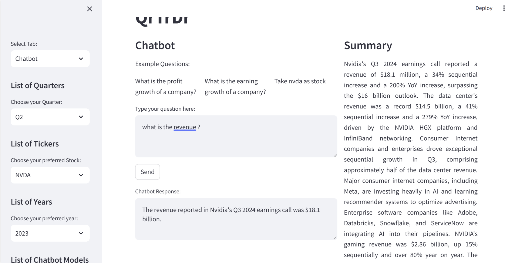
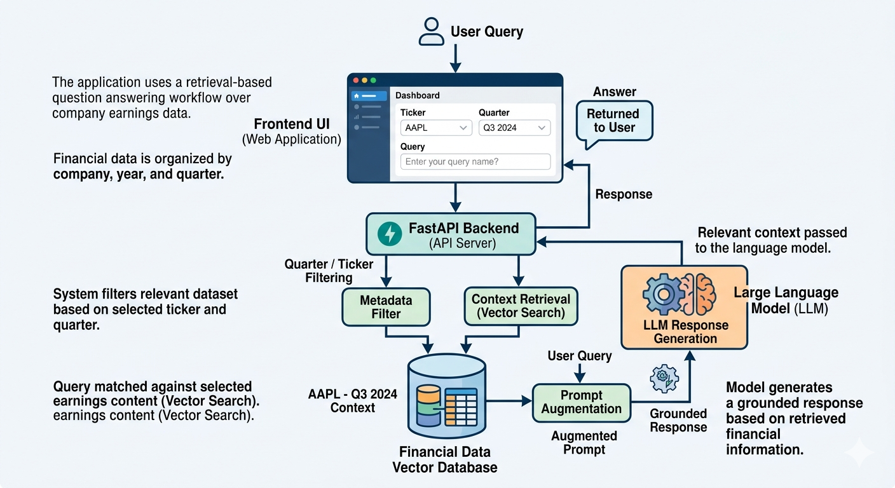

# AI-Driven Stock Market Querying & Data Retrieval

A Retrieval-Augmented Generation (RAG) system that enables users to query company earnings data using natural language.

The application allows users to ask questions such as revenue, earnings growth, or company performance using conversational queries instead of manually searching through financial reports.

It combines **vector search, structured filtering, and LLM reasoning** to generate grounded answers from financial data.


---

# Example Interface



The interface allows users to:

* Select company ticker
* Choose earnings quarter
* Ask financial questions
* Retrieve grounded responses based on earnings reports

Example query:

```
what is the revenue?
```

Example response:

```
The revenue reported in Nvidia's Q3 2024 earnings call was $18.1 billion.
```

---

# System Architecture



The system follows a Retrieval-Augmented Generation pipeline:

1. **User Query**

User submits a natural language financial question.

2. **Frontend Interface**

Web application allows users to select:

* company ticker
* quarter
* year
* query

3. **FastAPI Backend**

The backend processes the request and coordinates retrieval and generation.

4. **Metadata Filtering**

The system filters financial data using:

* company ticker
* quarter
* year

5. **Context Retrieval**

Relevant financial content is retrieved using vector search from the financial dataset.

6. **Prompt Augmentation**

Retrieved context is combined with the user query.

7. **LLM Response Generation**

The language model generates an answer grounded in the retrieved financial context.

8. **Response Returned**

The final answer is returned to the user interface.

---

# Why This Project Matters

Financial reports and earnings transcripts contain valuable insights but are often long and difficult to navigate.

This project demonstrates how modern AI systems can transform financial data into a conversational interface that allows users to explore earnings information quickly and efficiently.

It showcases an applied AI workflow combining:

* backend engineering
* retrieval systems
* natural language interfaces
* LLM reasoning

---

# Key Features

Natural language querying of financial data
Retrieval-Augmented Generation architecture
Quarter and company filtering
Vector search for contextual retrieval
Grounded responses from financial reports
FastAPI backend API
Interactive web interface

---

# Example Queries

Users can ask questions such as:

```
What is the revenue for this quarter?
What is the profit growth?
What drove Nvidia's revenue growth?
What is the gaming revenue?
What is the earnings outlook?
```

---

# Tech Stack

Python
FastAPI
Vector Search / RAG Pipeline
Large Language Models (LLMs)
HTML / JavaScript frontend
Financial data processing

---

# Project Structure

```
AI-Driven-Stock-Market-Querying/
│
├── app.py
├── retriever.py
├── llm_service.py
├── database.py
├── requirements.txt
│
├── static/
│   └── index.html
│
├── data/
│   ├── earnings_transcripts
│   └── processed_financial_data
│
├── demo.png
├── architecture.png

```

---

# Installation

Clone the repository

```
git clone https://github.com/MuntahaShams/AI-Driven-Stock-Market-Querying.git
cd AI-Driven-Stock-Market-Querying
```

Install dependencies

```
pip install -r requirements.txt
```

---

# Running the Application

Start the FastAPI server

```
uvicorn app:app --reload
```

Open the application in your browser

```
http://localhost:8000
```

---

# Challenges

Financial documents present several challenges:

* long earnings transcripts
* noisy textual data
* multiple financial metrics
* different formats across companies

This project addresses these challenges using retrieval-based context selection combined with LLM reasoning.

---

# Future Improvements

Add real-time financial APIs
Add financial chart visualization
Support multiple company comparison
Improve context ranking and retrieval
Add evaluation metrics for RAG performance

---

# Author

Muntaha Shams
AI Engineer — LLMs | NLP | Computer Vision | Document AI

GitHub
[https://github.com/MuntahaShams](https://github.com/MuntahaShams)

Portfolio
[https://muntahashams.github.io/portfolio/projects](https://muntahashams.github.io/portfolio/projects)

---
